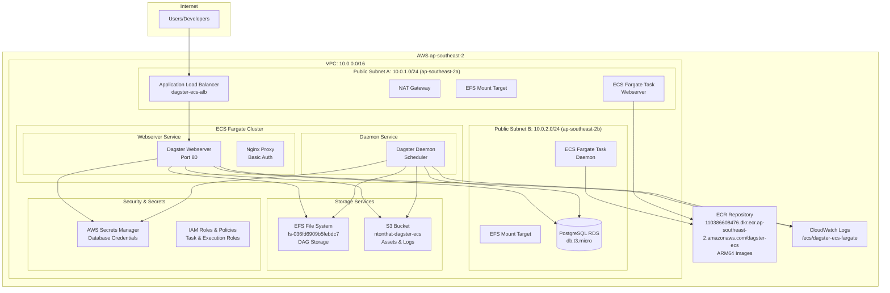
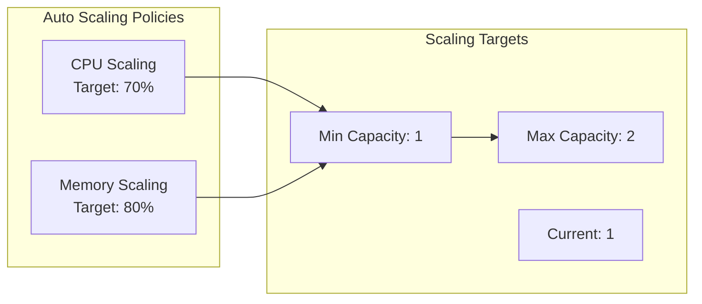
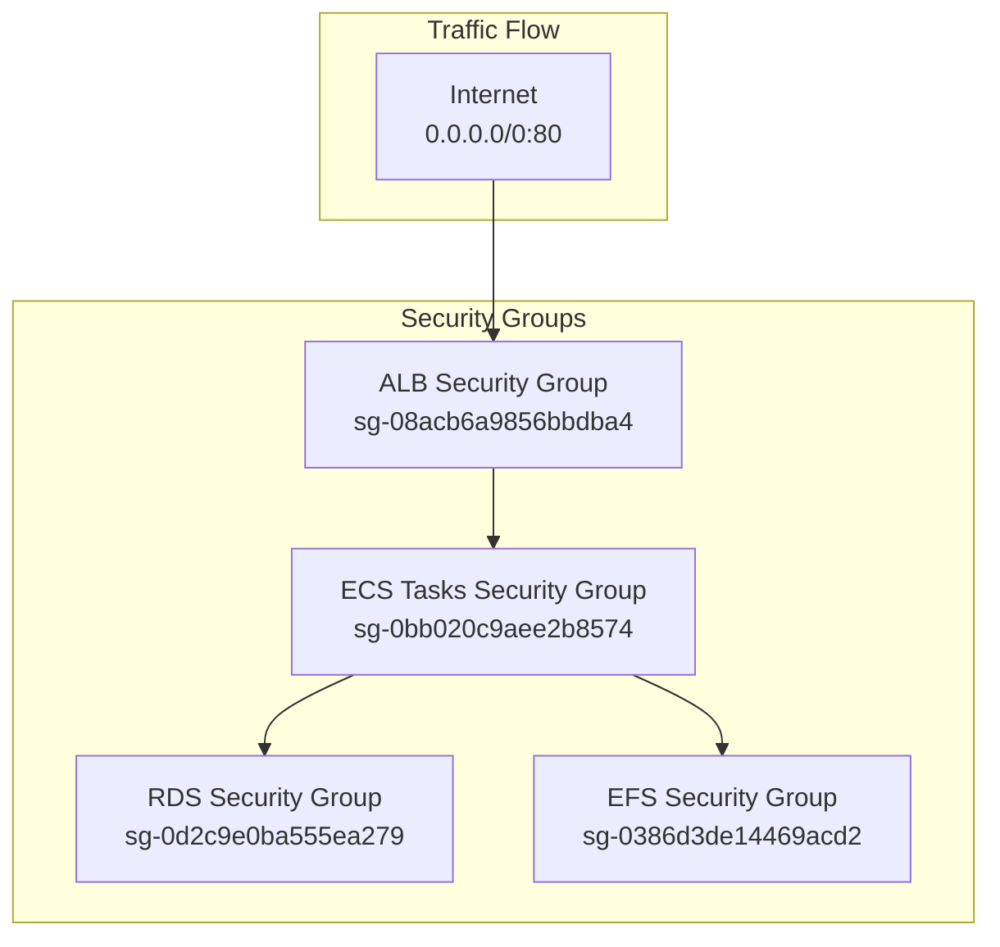
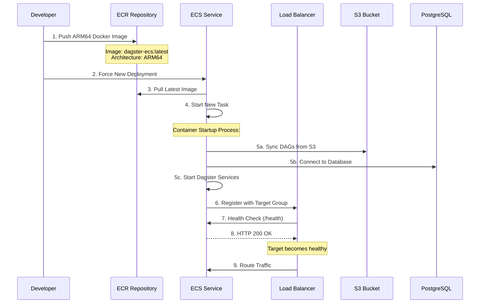
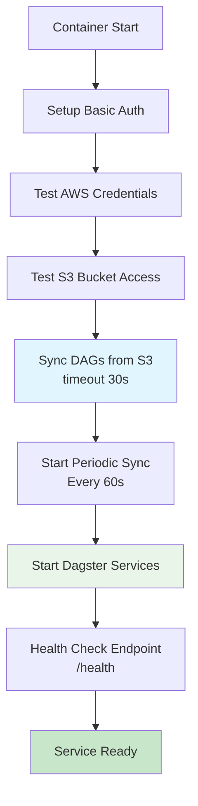

# Dagster ECS Fargate - Current Deployed Architecture

## Overview

This document describes the actual deployed architecture of the Dagster ECS Fargate deployment as it exists in AWS ap-southeast-2 region.

## High-Level Architecture

## Component Details

### Networking Infrastructure
- **VPC**: `vpc-03a6c5433c1e0bb48` (10.0.0.0/16)
- **Internet Gateway**: `igw-0d1c64c4101d8855d`
- **Public Subnets**:
  - Subnet A: `subnet-07be55adc4fc6f661` (ap-southeast-2a)
  - Subnet B: `subnet-07dc946e2edb6096e` (ap-southeast-2b)

### Load Balancing
- **Application Load Balancer**: `dagster-ecs-alb-1680764756.ap-southeast-2.elb.amazonaws.com`
- **Target Group**: `dagster-ecs-tg` (Health check: `/health`)
- **Listener**: Port 80 HTTP → Forward to ECS Tasks

### ECS Fargate Services
- **Cluster**: `dagster-ecs-fargate-cluster`
- **Services Running**: 2 active services
  - **Webserver Service**: `dagster-ecs-fargate-service`
    - Task Definition: `dagster-ecs-webserver-fargate:4`
    - Desired Count: 1
    - Connected to ALB Target Group
  - **Daemon Service**: `dagster-ecs-daemon-service`
    - Task Definition: `dagster-ecs-daemon-fargate:1`
    - Desired Count: 1
    - Background scheduler

### Container Specifications
- **Architecture**: ARM64 (Fargate ARM)
- **CPU**: 256 units (0.25 vCPU)
- **Memory**: 512 MB
- **Image**: `110386608476.dkr.ecr.ap-southeast-2.amazonaws.com/dagster-ecs:latest`
- **Runtime Platform**: Linux ARM64

### Database
- **Engine**: PostgreSQL 15.13
- **Instance**: `db.t3.micro` (Free Tier)
- **Identifier**: `dagster-ecs-db`
- **Status**: Available
- **VPC**: Same as ECS (`vpc-03a6c5433c1e0bb48`)
- **Availability Zone**: ap-southeast-2a

### Storage
- **EFS File System**: `fs-036fd6909b5febdc7`
  - Mount Targets in both AZs
  - Used for DAG file synchronization
- **S3 Bucket**: `ntonthat-dagster-ecs`
  - DAG source files in `/dags/` prefix
  - Asset storage and logs

### Security & IAM
- **Task Execution Role**: `dagster-ecs-ecs-task-execution-fargate`
- **Task Role**: `dagster-ecs-ecs-task-fargate`
- **S3 User**: `dagster-ecs-s3-user`
- **Secrets Manager**: `dagster-ecs-aws-credentials`

## Auto Scaling Configuration

## Network Security Groups

## Deployment Process Flow

## Container Startup Sequence

## Resource Utilization

### Current Deployment Scale
- **ECS Tasks**: 2 running (1 webserver, 1 daemon)
- **Load Balancer Targets**: 1 healthy
- **Database Connections**: Active PostgreSQL connection
- **Storage**: EFS mounted, S3 sync active

### Cost Optimization Features
- **ARM64 Architecture**: ~20% cost savings vs x86_64
- **Fargate Spot**: Not currently enabled
- **Auto Scaling**: Scales 1-2 instances based on demand
- **Free Tier Usage**: 
  - RDS db.t3.micro (750 hours/month)
  - ECS Fargate (limited free tier)

## Access & Security

### Public Endpoints
- **Dagster Web UI**: http://dagster-ecs-alb-1680764756.ap-southeast-2.elb.amazonaws.com
- **Authentication**: Basic Auth (admin user)

### Private Resources
- **Database**: Private subnets, security group restricted
- **EFS**: VPC-only access via mount targets
- **S3**: IAM role-based access only

## Monitoring & Logging

### CloudWatch Integration
- **Log Groups**: `/ecs/dagster-ecs-fargate`
- **Metrics**: ECS service metrics, ALB metrics
- **Auto Scaling**: CPU and Memory based policies

### Health Monitoring
- **ALB Health Checks**: `/health` endpoint every 30s
- **ECS Service Health**: Task replacement on failures
- **Target Group**: Automatic deregistration/registration