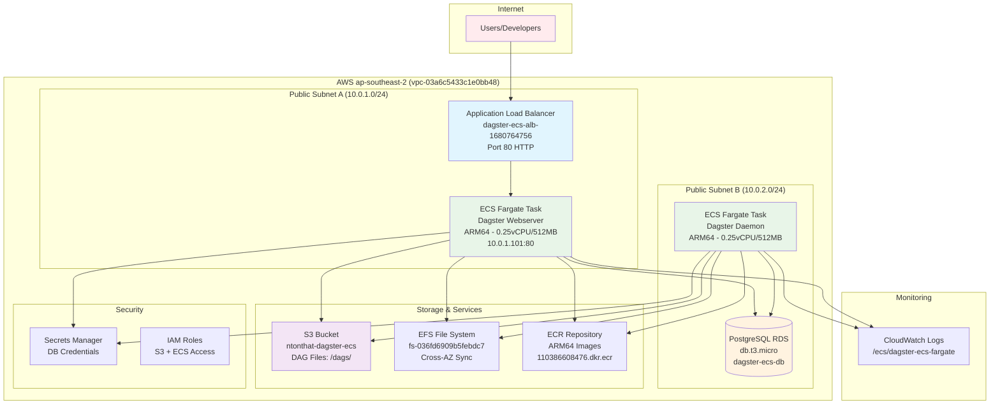
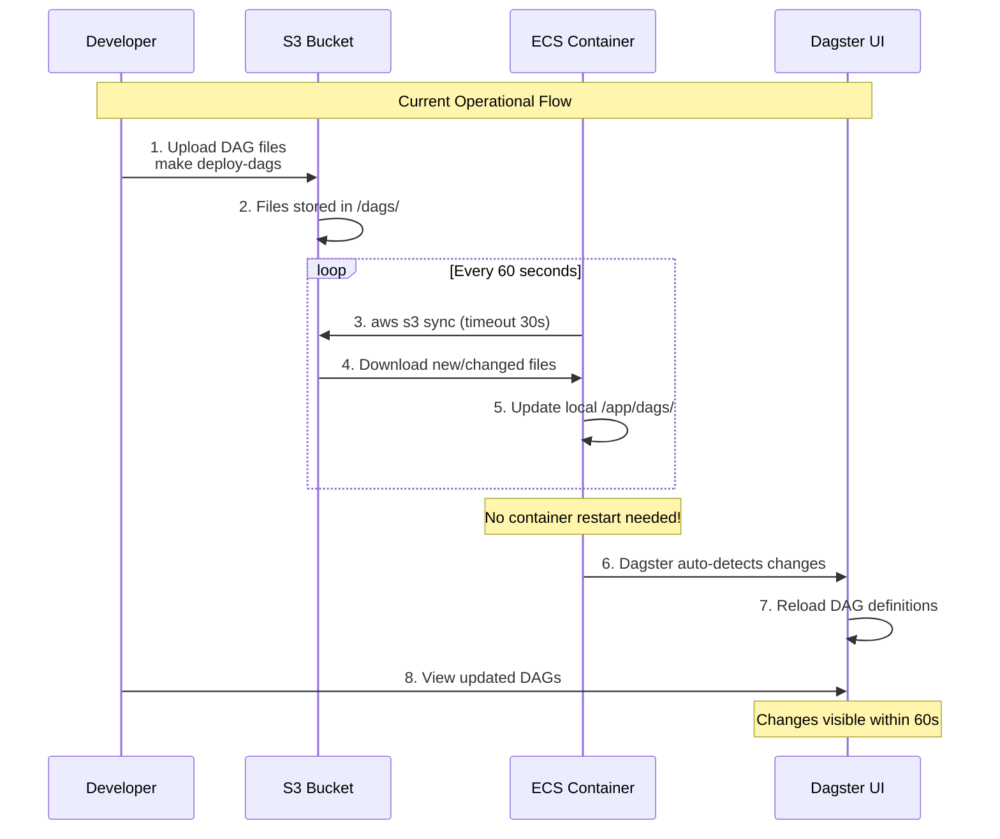

# Dagster ECS Dynamic DAG Loading Architecture - DEPLOYED

## Overview

This document describes the **currently deployed** Dagster ECS Fargate architecture in AWS ap-southeast-2. The system provides a **dynamic DAG loading architecture** where DAG files are stored in S3 and automatically synced to ECS containers every 60 seconds. This eliminates the need to rebuild Docker images when DAG code changes, providing faster deployments and better separation of concerns.

The architecture is **successfully deployed and operational** with cost optimization and high scalability features, leveraging AWS Free Tier resources while maintaining production-grade capabilities.

## 🚀 Current Deployment Status

**✅ OPERATIONAL**: All services running and healthy
- **Web UI**: http://dagster-ecs-alb-1680764756.ap-southeast-2.elb.amazonaws.com
- **Authentication**: Basic auth enabled (admin user)
- **Services**: 2 ECS services running (webserver + daemon)
- **Database**: PostgreSQL RDS available
- **Auto Scaling**: Active (1-2 instances)
- **DAG Sync**: S3 to EFS sync operational

## Cost-Optimized Infrastructure

### Resource Allocation (Optimized for 2-3 Concurrent Users)
- **ECS Tasks**: 0.25 vCPU, 512MB RAM per service (ARM64 architecture)
- **Auto Scaling**: 1-2 instances based on demand (CPU: 70%, Memory: 80%)
- **Database**: RDS db.t3.micro (Free Tier eligible)
- **Storage**: EFS burst mode + S3 standard tier
- **Networking**: Minimal VPC configuration

### Monthly Cost Breakdown
**AWS Free Tier (First 12 months):**
- ECS Fargate: ~$3-5/month (minimal ARM64 tasks)
- RDS PostgreSQL: $0 (750 hours/month included)
- EFS Storage: $0 (5GB included)
- S3 Storage: $0 (5GB included)
- **Total**: ~$3-8/month

**Post Free Tier:**
- ECS Fargate: ~$8-12/month
- RDS PostgreSQL: ~$12-15/month
- EFS + S3: ~$2-5/month
- **Total**: ~$22-32/month

### Scalability Design
- **Horizontal Scaling**: Automatic ECS task scaling
- **Vertical Scaling**: Easy resource adjustments in OpenTofu
- **Storage Scaling**: Unlimited S3/EFS expansion
- **Multi-Repository**: Isolated cost tracking per repository

## Architecture Components

### 1. Dynamic DAG Loading System
- **S3 Storage**: DAG files stored in `s3://bucket/dags/` subfolder structure
- **Container Sync**: ECS containers automatically sync DAG files every 60 seconds
- **No Rebuilds**: DAG changes don't require Docker image rebuilds
- **Workspace Configuration**: Points to local DAG files synced from S3

### 2. Secure Credential Management
- **AWS Secrets Manager**: Stores S3 access credentials securely
- **IAM User**: Dedicated user with minimal S3 permissions
- **ECS Integration**: Secrets automatically injected into containers
- **No Hardcoded Values**: All credentials and bucket names configurable

### 3. Container Runtime Architecture
- **Base Runtime**: Docker image contains only Dagster runtime and sync scripts
- **Dynamic Content**: DAG files loaded at runtime from S3
- **Required Variables**: `DAGSTER_S3_BUCKET` must be set (container fails if missing)
- **Health Monitoring**: Container health tied to S3 sync success

## Deployment Workflow

### DAG Development & Deployment (Fast Path)

1. **Edit DAG Files Locally**
   ```bash
   # Edit your DAG files
   vim dags/main/assets.py
   vim dags/main/jobs.py
   ```

2. **Deploy DAGs to S3 (No Docker Rebuild)**
   ```bash
   make deploy-dags
   # Files uploaded to S3 in seconds
   # Containers auto-sync within 60 seconds
   # No service restart required!
   ```

3. **Verify Deployment**
   - DAGs appear in Dagster UI within 60 seconds
   - No downtime or service interruption

### Runtime Changes (Full Deployment Path)

1. **Infrastructure or Dockerfile Changes**
   ```bash
   make build         # Build new Docker image
   make push          # Push to ECR
   make deploy        # Restart ECS services
   ```

2. **Full Deployment (DAGs + Runtime)**
   ```bash
   make deploy-all    # Deploy DAGs AND restart containers
   ```

### S3 Bucket Structure
```
s3://your-bucket-name/
└── dags/                 # DAG files synced to containers
    ├── __init__.py       # Root DAG definitions
    └── main/             # Main DAG package
        ├── __init__.py   # Package definitions
        ├── assets.py     # Asset definitions
        ├── jobs.py       # Job definitions
        └── resources.py  # Resource configurations
```

## 🏗️ Deployed Architecture Diagram



## 🔄 Dynamic DAG Loading Flow



## Implementation Components

### 1. Container Entrypoint Script (`docker/entrypoint.sh`)
- **S3 Sync Logic**: Downloads DAG files from S3 on startup
- **Periodic Refresh**: Background process syncs every 60 seconds
- **Error Handling**: Detailed logging and failure detection
- **Credential Testing**: Validates AWS credentials before sync

### 2. Dockerfile Architecture (`docker/Dockerfile`)
- **Runtime Only**: Contains Dagster, AWS CLI, and sync scripts
- **No DAG Files**: DAG files excluded from image build
- **Required Variables**: `DAGSTER_S3_BUCKET` must be provided at runtime
- **Security**: No hardcoded credentials or bucket names

### 3. AWS Infrastructure Components
- **ECS Task Definition**: Configured with Secrets Manager integration
- **IAM Roles**: Separate execution and task roles with minimal permissions
- **Secrets Manager**: Secure storage for S3 access credentials
- **S3 Bucket**: Configurable bucket name via Terraform variables

## Configuration

### Environment Variables
```bash
# Required (container fails if not set)
DAGSTER_S3_BUCKET=your-bucket-name

# Database connection
DAGSTER_POSTGRES_HOST=rds-endpoint
DAGSTER_POSTGRES_USER=dagster
DAGSTER_POSTGRES_PASSWORD=password
DAGSTER_POSTGRES_DB=dagster
DAGSTER_POSTGRES_PORT=5432

# AWS region (optional)
AWS_DEFAULT_REGION=ap-southeast-2
```

### AWS Secrets Manager Configuration
```json
{
  "AWS_ACCESS_KEY_ID": "AKIA...",
  "AWS_SECRET_ACCESS_KEY": "..."
}
```

### Workspace Configuration (`workspace.yaml`)
```yaml
# Points to dynamically synced DAG files
load_from:
  - python_file:
      relative_path: dags/main/__init__.py
      location_name: main
```

### Terraform Outputs
```bash
# Available after infrastructure deployment
tofu output aws_access_key_id      # S3 access key (sensitive)
tofu output aws_secret_access_key  # S3 secret key (sensitive)
tofu output load_balancer_url      # Dagster UI URL
tofu output s3_bucket_name         # Bucket for DAG storage
```

## Security Model

### Principle of Least Privilege
```
ECS Execution Role
├── Read from AWS Secrets Manager ✓
└── Pull container images from ECR ✓

ECS Task Role  
├── Access EFS file system ✓
└── Read from Secrets Manager ✓

IAM User (for S3)
├── s3:GetObject on specific bucket ✓
├── s3:ListBucket on specific bucket ✓
└── s3:GetBucketLocation ✓
```

### No Hardcoded Credentials
- ✅ All bucket names configurable via Terraform variables
- ✅ AWS credentials stored in Secrets Manager only
- ✅ Container fails if required environment variables missing
- ✅ No credentials in Docker images or code

### Network Security
- ✅ ECS tasks in private subnets
- ✅ ALB in public subnets for UI access
- ✅ RDS in private subnets with security group isolation
- ✅ S3 access over HTTPS only

## Available Commands

### DAG Deployment
```bash
make deploy-dags           # Upload DAG files to S3 (fast deployment)
make deploy               # Restart ECS containers with latest image
make deploy-all           # Deploy DAGs + restart containers
```

### Infrastructure Management  
```bash
make infra-init           # Initialize Terraform backend
make infra-plan           # Preview infrastructure changes
make infra-apply          # Apply infrastructure changes
make infra-destroy        # Destroy all infrastructure
```

### Development & Monitoring
```bash
make dev                  # Start local development environment
make logs                 # View ECS container logs
make build                # Build Docker image locally
make push                 # Push Docker image to ECR
```

## Benefits

### Development Velocity
- **DAG Changes**: Deploy in seconds (S3 upload + 60s auto-sync)
- **No Docker Rebuilds**: DAG changes don't require container rebuilds
- **No Service Restarts**: Containers automatically pick up new DAGs
- **Rapid Iteration**: Edit → Upload → Test cycle under 2 minutes

### Cost Optimization
- **Faster Deployments**: Less compute time for DAG changes
- **No ECR Storage**: DAG-only changes don't create new container images
- **Efficient Resources**: Container resources focused on runtime, not storage

### Operational Excellence
- **Clear Separation**: Runtime deployment vs DAG deployment
- **Rollback Capability**: Easy rollback by reverting S3 files
- **Centralized Storage**: All DAGs versioned and stored in S3
- **Health Monitoring**: Container health tied to sync success

## Migration from Previous Architecture

**Before (Coupled Architecture):**
```
DAG Change → Docker Build → ECR Push → ECS Deploy → 5-10 minute deployment
```

**After (Dynamic Loading Architecture):**
```
DAG Change → S3 Upload → Auto-Sync → 60 second deployment  
Runtime Change → Docker Build → ECR Push → ECS Deploy → 5-10 minute deployment
```

This architecture provides **10x faster DAG deployments** while maintaining the same deployment process for infrastructure and runtime changes.