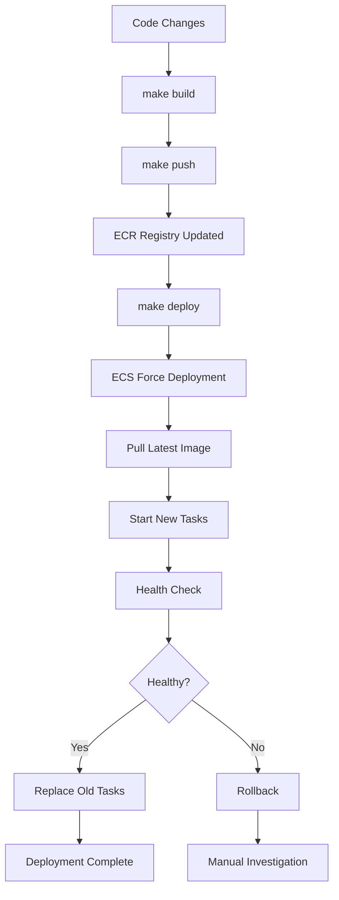

# 🚀 Deployment Process Documentation

## ECS Fargate Image Updates

### How ECS Handles New Images

When you push a new Docker image and trigger a deployment, ECS Fargate automatically:

1. **Image Pull**: Pulls the latest image from ECR (`:latest` tag)
2. **Task Creation**: Creates new tasks with the updated image
3. **Rolling Deployment**: Gradually replaces old tasks with new ones
4. **Health Checks**: Ensures new tasks are healthy before terminating old ones
5. **Zero Downtime**: Maintains service availability during updates

### Our Deployment Commands

```bash
# Full deployment process
make build      # Build Docker image locally
make push       # Push to ECR (triggers automatic image pull)
make deploy     # Force ECS service update
```

### Deployment Flow



### Key Points

- **Automatic**: ECS automatically pulls `:latest` when deploying
- **Rolling**: No downtime during updates
- **Health Checks**: Load balancer health checks ensure stability
- **Rollback**: Failed deployments can be rolled back manually

### DAG-Only Updates (Faster)

For DAG changes without code changes:

```bash
make deploy-dags  # Upload to S3, auto-sync in ~60 seconds
```

This bypasses Docker rebuilds for faster iteration.

## Database Persistence

### PostgreSQL RDS Configuration

Our setup uses **AWS RDS PostgreSQL** for persistence:

- **Instance**: `db.t3.micro` (Free Tier eligible)
- **Storage**: 20GB GP2 with encryption
- **Networking**: Private subnets only
- **Security**: Security groups restricting access to ECS tasks only

### Free Tier Optimization

- ✅ **750 hours/month** of `db.t3.micro` usage (Free Tier)
- ✅ **20GB storage** included (Free Tier)
- ✅ **No backup retention** to save costs
- ✅ **Encrypted at rest** for security

### Local vs Production Database

| Environment | Database | Persistence |
|-------------|----------|-------------|
| **Local** | Docker PostgreSQL | Volume mounted |
| **Production** | AWS RDS PostgreSQL | Fully managed |

Both use the same PostgreSQL version and configuration for consistency.

## Sample DAG

### Hacker News Analytics Pipeline

Our sample DAG demonstrates a real-world data pipeline:

1. **`hackernews_top_story_ids`**: Fetch top story IDs from API
2. **`hackernews_top_stories`**: Get detailed story information
3. **`most_frequent_words`**: Analyze titles for common words

### Benefits

- ✅ **Real API calls**: Tests network connectivity
- ✅ **Data processing**: Shows pandas integration
- ✅ **Logging**: Demonstrates Dagster logging
- ✅ **Dependencies**: Shows asset dependency graph
- ✅ **Error handling**: Robust to API failures

### Running the Pipeline

1. Start local environment: `make dev`
2. Access UI: http://localhost:3000
3. Login: `admin` / `DagsterPipeline2024!`
4. Navigate to Assets tab
5. Click "Materialize All" to run the pipeline

## Cost Optimization

### AWS Free Tier Usage

| Service | Free Tier Limit | Our Usage |
|---------|-----------------|-----------|
| **ECS Fargate** | - | ~$3-5/month (ARM64) |
| **RDS PostgreSQL** | 750 hours | ~750 hours |
| **S3 Storage** | 5GB | <1GB |
| **ALB** | - | ~$16/month |
| **EFS** | 5GB | <100MB |

**Estimated Monthly Cost**: $20-25 (mostly ALB)

### Cost Reduction Tips

1. **Stop services when not in use**:
   ```bash
   # Stop ECS services to save costs
   aws ecs update-service --cluster dagster-ecs-fargate-cluster --service dagster-ecs-fargate-service --desired-count 0
   aws ecs update-service --cluster dagster-ecs-fargate-cluster --service dagster-ecs-daemon-service --desired-count 0
   ```

2. **Use Spot instances** (for non-critical workloads)
3. **Schedule auto-shutdown** for development environments