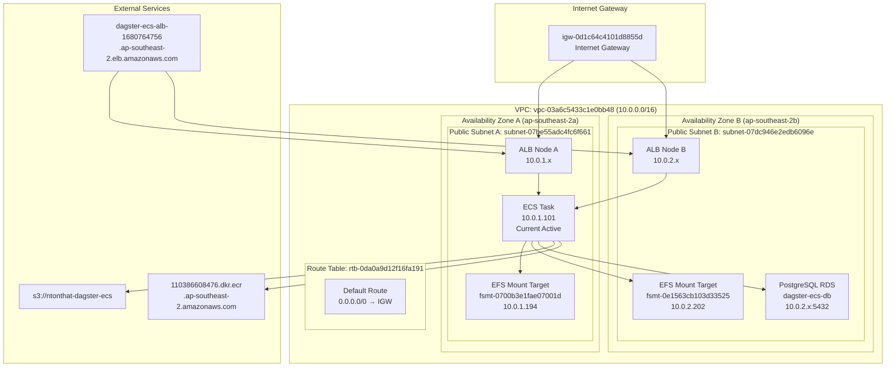
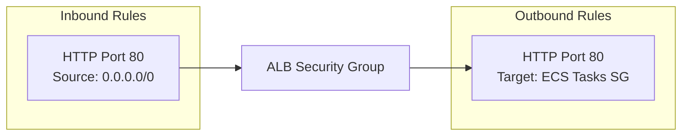
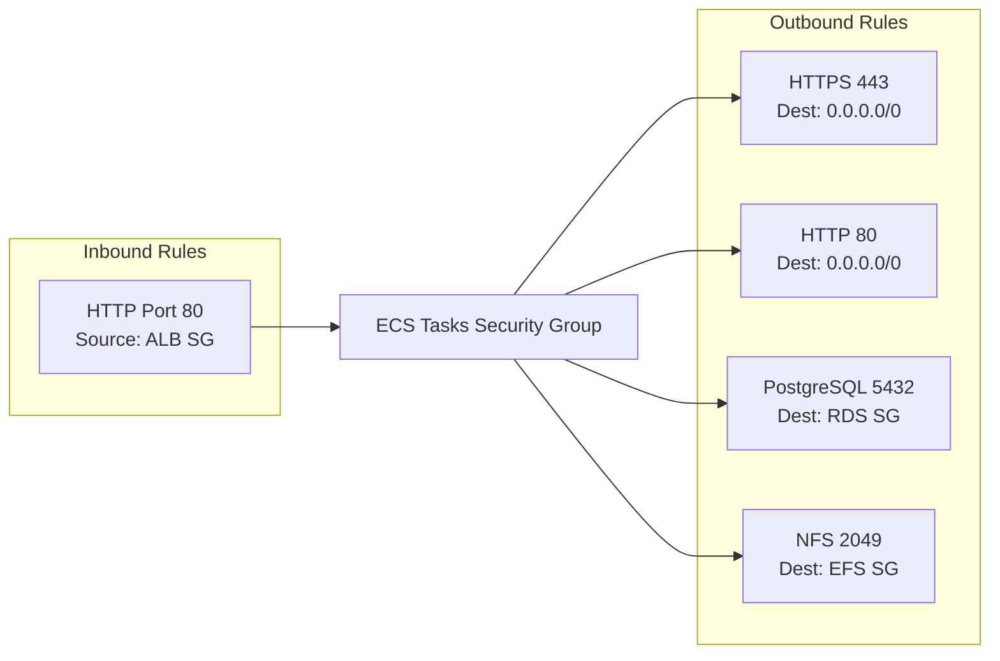
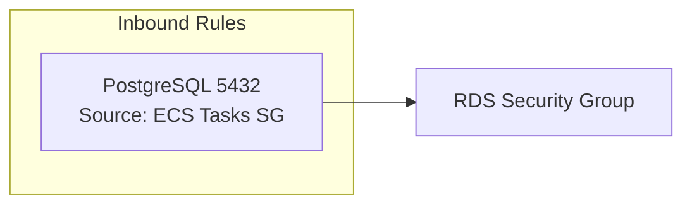
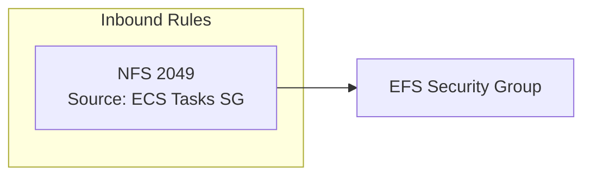
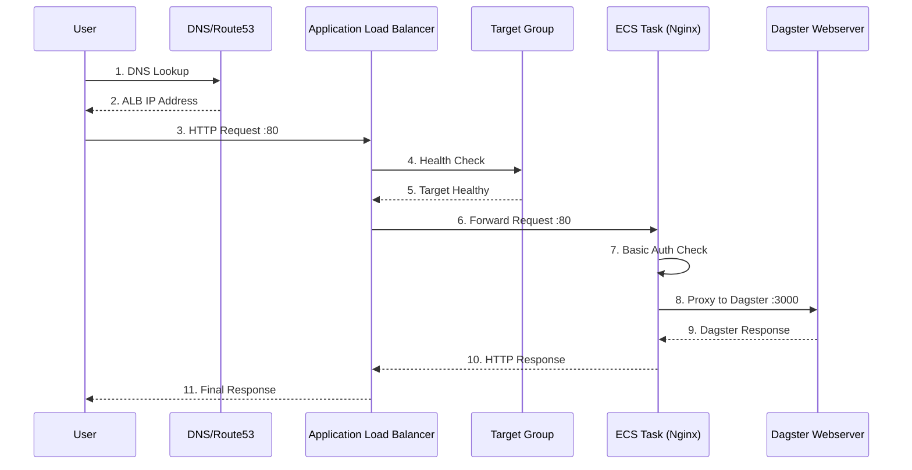
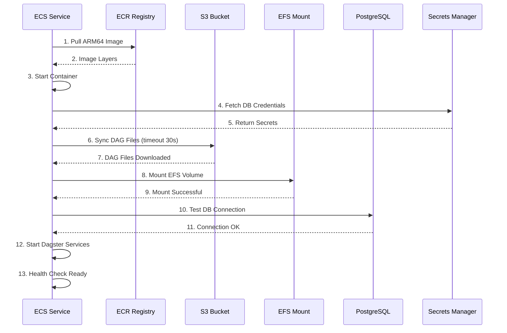
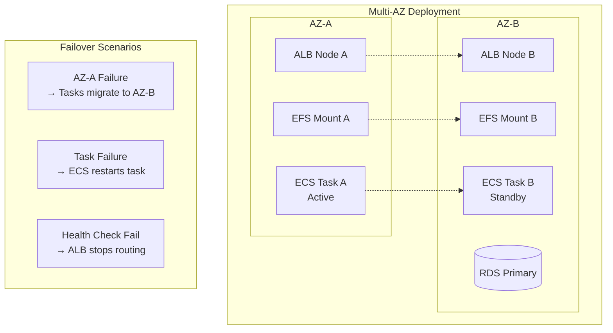

# Dagster ECS - Detailed Network Architecture

## Network Topology



## Security Group Rules

### ALB Security Group (sg-08acb6a9856bbdba4)


### ECS Tasks Security Group (sg-0bb020c9aee2b8574)


### RDS Security Group (sg-0d2c9e0ba555ea279)


### EFS Security Group (sg-0386d3de14469acd2)


## Traffic Flow Patterns

### User Request Flow


### Container Initialization Flow


## Network Performance Characteristics

### Latency Considerations
- **ALB → ECS**: < 1ms (same AZ preferred)
- **ECS → RDS**: < 2ms (same VPC)
- **ECS → EFS**: < 1ms (local mount targets)
- **ECS → S3**: 5-20ms (regional service)
- **User → ALB**: Varies by location

### Bandwidth Allocation
- **Fargate Task**: Up to 25 Gbps network performance
- **EFS Throughput**: Burst mode (up to 100 MiB/s)
- **RDS**: Up to 2,085 Mbps (t3.micro)
- **ALB**: Automatically scales

## High Availability Design



## Container Networking Details

### Network Mode: awsvpc
- Each task gets its own ENI (Elastic Network Interface)
- Private IP assigned from subnet CIDR
- Direct VPC networking without port mapping
- Full security group integration

### DNS Resolution
- **VPC DNS**: Enabled (169.254.169.253)
- **Route53 Private Zones**: Available
- **Service Discovery**: AWS Cloud Map ready
- **Container DNS**: Inherit from VPC

### IP Allocation
```
VPC CIDR: 10.0.0.0/16 (65,536 IPs)
├── Subnet A: 10.0.1.0/24 (256 IPs)
│   ├── ALB: 10.0.1.x (2-3 IPs)
│   ├── EFS Mount: 10.0.1.194
│   ├── ECS Tasks: 10.0.1.101+
│   └── Available: ~250 IPs
└── Subnet B: 10.0.2.0/24 (256 IPs)
    ├── ALB: 10.0.2.x (2-3 IPs)
    ├── EFS Mount: 10.0.2.202
    ├── RDS: 10.0.2.x
    └── Available: ~250 IPs
```

## Monitoring Network Health

### CloudWatch Metrics
- **ALB Metrics**: Request count, latency, target health
- **ECS Metrics**: Network utilization, task health
- **VPC Flow Logs**: Available for troubleshooting

### Health Check Configuration
```yaml
Target Group Health Check:
  Protocol: HTTP
  Port: 80
  Path: /health
  Interval: 30 seconds
  Timeout: 5 seconds
  Healthy Threshold: 2
  Unhealthy Threshold: 2
```