# Dagster ECS Fargate Deployment

[](https://www.python.org/downloads/)
[](https://github.com/astral-sh/ruff)
[](https://opentofu.org/)
[](https://dagster.io/)
[](https://aws.amazon.com/ecs/)

Modern data orchestration platform deployed on AWS ECS Fargate with **dynamic DAG loading** for rapid deployment and scalable, serverless data pipeline management.

## 🏗️ Architecture

### ☁️ Infrastructure Components

- **ECS Fargate**: Serverless container orchestration for auto-scaling Dagster services
- **S3 Dynamic Loading**: DAG files stored in S3 and synced to containers every 60 seconds
- **AWS Secrets Manager**: Secure credential storage for S3 access
- **PostgreSQL**: Metadata storage for Dagster state and run history
- **ECR**: Container registry for Dagster runtime images (no DAG files)
- **IAM**: Least-privilege security model with dedicated roles

### 📁 DAG Organisation (Dynamic S3 Loading)

```
# Local development structure
dags/
├── __init__.py           # Root DAG definitions
└── main/                 # Main DAG package
    ├── __init__.py       # Package definitions  
    ├── assets.py         # Asset definitions
    ├── jobs.py           # Job definitions
    └── resources.py      # S3 prefix isolation resources

# S3 storage structure (automatically synced)
s3://your-bucket/
└── dags/                 # Synced to containers every 60s
    ├── __init__.py
    └── main/
        ├── __init__.py
        ├── assets.py
        ├── jobs.py
        └── resources.py
```

⚡ **Fast Deployment**: DAG changes deploy via S3 upload (seconds) vs Docker rebuild (minutes)

## 🔄 Development Workflow (Dynamic Loading)

```mermaid
flowchart LR
    A[Start Development] --> B[make install]
    B --> C[make dev]
    C --> D[Edit DAG Logic]
    D --> E[make test]
    E --> F{Tests Pass?}
    F -->|No| D
    F -->|Yes| G[Verify in Local UI]
    G --> H[make deploy-dags]
    H --> I[⚡ Auto-sync in 60s]
    I --> J[Verify in Production UI]
    J --> K[Git Commit & Push]
    
    style A fill:#e1f5fe
    style I fill:#c8e6c9
    style H fill:#ffeb3b
    style F fill:#fff3e0
```



⚡ **10x Faster**: DAG changes deploy in ~60 seconds (no Docker rebuilds!)

## 🚀 Quick Start

### 📋 Prerequisites

- Docker and Docker Compose
- uv (Python package manager)
- Python 3.12+

### 💻 Local Development

1. **Clone and setup**:

   ```bash
   git clone <repo-url>
   cd dagster-ecs
   make install  # Installs Python dependencies with uv
   ```

2. **Start local environment**:

   ```bash
   make dev  # Starts local Dagster stack
   ```

3. **Access Dagster UI**:
   Open <http://localhost:3000>

### 🔄 Development Workflow (New Dynamic Approach)

1. **Edit DAG files directly**:

   ```bash
   # Edit existing DAG files
   vim dags/main/assets.py
   vim dags/main/jobs.py
   
   # Or create new DAG from template
   make create dag=my_new_pipeline
   ```

2. **Test locally**:

   ```bash
   make test  # Runs type checking, linting, and tests
   ```

3. **Verify in Local Dagster UI**:
   - Check that your changes appear at <http://localhost:3000>
   - Test asset materialisation locally

4. **Deploy DAGs (Fast Path - 60 seconds)**:

   ```bash
   make deploy-dags  # Upload to S3, auto-sync in 60s
   ```

5. **For Runtime Changes (Full Path - 5-10 minutes)**:

   ```bash
   make build && make push && make deploy  # Docker rebuild + ECS restart
   ```

6. **Commit when ready**:

   ```bash
   git add .
   git commit -m "Update DAG logic"
   git push origin main
   ```

## ✍️ Writing DAGs

### 📝 DAG Creation

Create new DAGs using the Makefile command:

```bash
make create name=my_pipeline
```

This automatically:

- Copies the template DAG
- Replaces all template references with your DAG name
- Creates `dags/main/my_pipeline_dag.py`

### 🔧 Customizing Your DAG

After creating a new DAG:

1. **Implement your logic** in the generated file
2. **Update asset functions** with your data processing
3. **Test locally** with `make test`
4. **Verify in Dagster UI** at <http://localhost:3000>

### 🗄️ S3 Integration

All assets automatically get S3 prefix isolation:

- Repository `main` → S3 prefix `repos/main/`
- Repository `analytics` → S3 prefix `repos/analytics/`

The S3PrefixResource handles this automatically - just use standard Dagster S3 operations.

## 🧪 Testing Strategy

### 🏠 Local Testing

```bash
# Run all tests (type checking, linting, pytest)
make test

# Start local development environment
make dev

# Test DAGs in Dagster UI at http://localhost:3000
```

### ✅ Pre-deployment Checklist

- [ ] DAG appears in local Dagster UI
- [ ] All assets materialise successfully
- [ ] S3 operations use correct prefix
- [ ] No linting or type errors
- [ ] Tests pass

## 🚢 Deployment

### ⚡ Fast DAG Deployment (Recommended)

```bash
# Deploy DAG changes only (60 second deployment)
make deploy-dags

# Deploy DAGs + restart containers  
make deploy-all
```

### 🔄 Infrastructure Deployment

```bash
# Deploy infrastructure changes
make infra-apply

# Build and deploy runtime changes
make build
make push  
make deploy
```

### 🛠️ Manual Deployment Commands

```bash
# DAG deployment
./scripts/deploy-dags.sh

# Infrastructure management
cd infrastructure
tofu plan
tofu apply

# Container deployment  
docker build -f docker/Dockerfile -t dagster-ecs .
aws ecr get-login-password --region ap-southeast-2 | docker login --username AWS --password-stdin <account>.dkr.ecr.ap-southeast-2.amazonaws.com
docker tag dagster-ecs:latest <account>.dkr.ecr.ap-southeast-2.amazonaws.com/dagster-ecs:latest
docker push <account>.dkr.ecr.ap-southeast-2.amazonaws.com/dagster-ecs:latest
aws ecs update-service --cluster dagster-ecs-fargate-cluster --service dagster-ecs-fargate-service --force-new-deployment
```

## 🌍 Environment Variables

### 🏠 Local Development

Set in `docker-compose.yml`:

- `DAGSTER_POSTGRES_*`: Database connection
- `DAGSTER_HOME`: Dagster configuration directory

### ☁️ Production (ECS)

**Required Variables** (container fails if missing):

- `DAGSTER_S3_BUCKET`: S3 bucket name for DAG storage
- `DAGSTER_POSTGRES_*`: RDS connection details

**AWS Secrets Manager** (automatically injected):

- `AWS_ACCESS_KEY_ID`: S3 access key (from Secrets Manager)
- `AWS_SECRET_ACCESS_KEY`: S3 secret key (from Secrets Manager)

**Optional Variables**:

- `AWS_DEFAULT_REGION`: AWS region (default: ap-southeast-2)

### 🔑 Terraform Outputs

After infrastructure deployment:

```bash
# Quick access via Makefile (recommended)
make aws-credentials   # Show AWS credentials (access key + secret key, one per line)
make url              # Show Dagster web UI URL
make help             # Show all available commands (auto-generated)

# Direct terraform access
cd infrastructure
tofu output aws_access_key_id     # S3 access key (sensitive)
tofu output aws_secret_access_key # S3 secret key (sensitive)
tofu output load_balancer_url     # Dagster UI URL
tofu output s3_bucket_name        # S3 bucket for DAGs
```

## 💬 Support

For issues or questions:

- Check the Dagster documentation: <https://docs.dagster.io/>
- Review logs: `docker-compose logs dagster`
- Monitor ECS service in AWS Console
