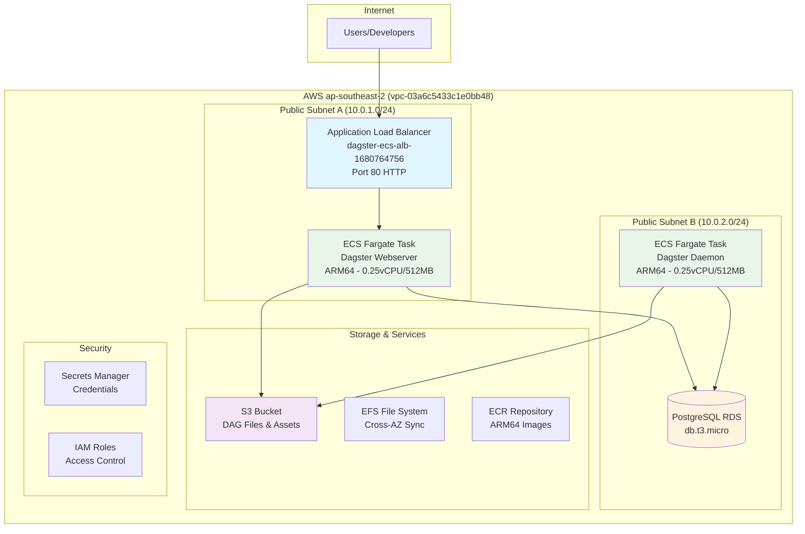
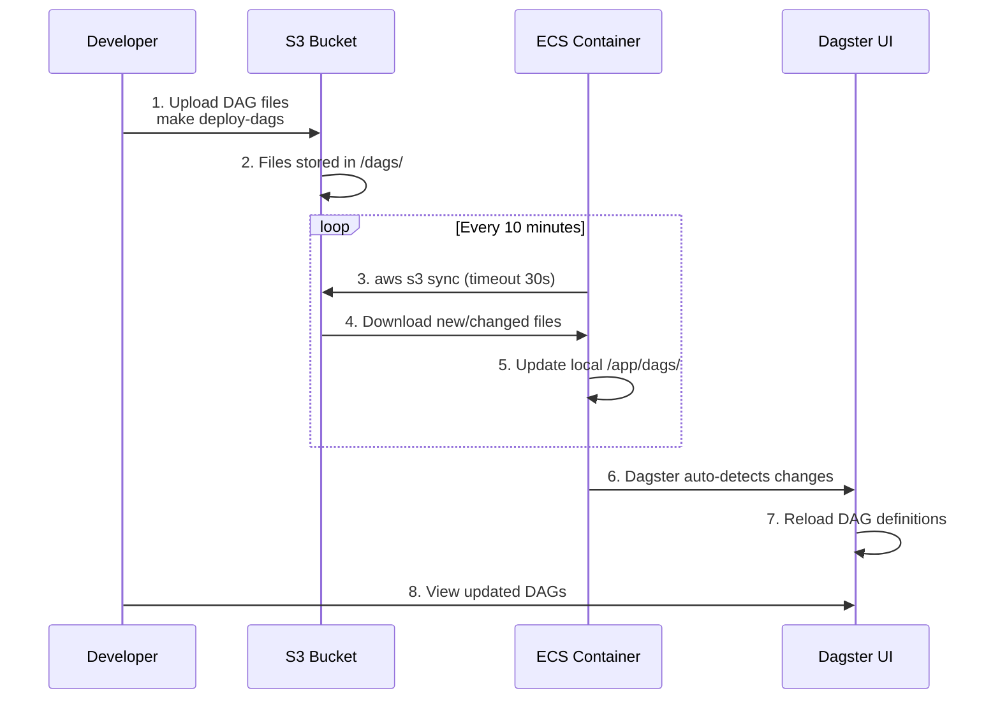
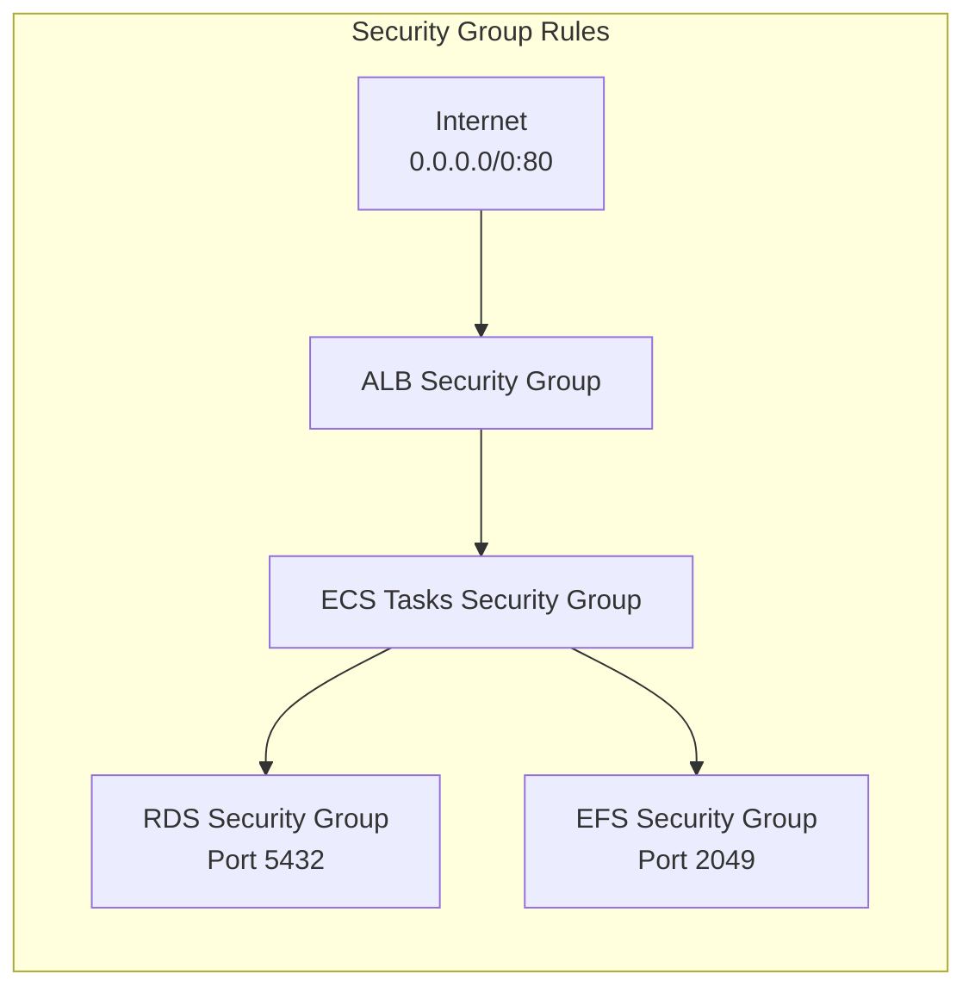
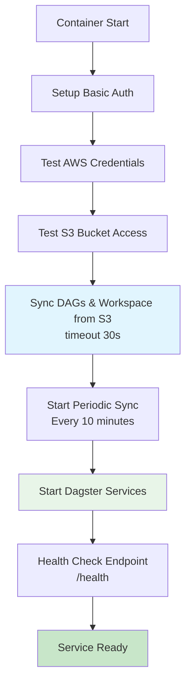

# Dagster ECS Architecture & Infrastructure

## Overview

This document describes the complete architecture of the Dagster ECS Fargate deployment - a cost-optimized, production-ready data orchestration platform running on AWS. The system features **dynamic DAG loading** from S3, eliminating Docker rebuilds for pipeline changes and enabling rapid development cycles.

## 🏗️ System Architecture

### High-Level Components



### Infrastructure Specifications

| Component | Configuration | Purpose |
|-----------|---------------|---------|
| **ECS Fargate** | 0.25 vCPU, 512MB RAM (ARM64) | Container runtime |
| **PostgreSQL RDS** | db.t3.micro (Free Tier) | Metadata storage |
| **Application Load Balancer** | Multi-AZ, health checks | Traffic routing |
| **S3 Bucket** | Standard tier | DAG files & assets |
| **EFS File System** | Burst mode, multi-AZ | Shared storage |
| **ECR Repository** | ARM64 images | Container registry |

## 🔄 Dynamic DAG Loading System

### Architecture Benefits

**Traditional Approach:**
```
DAG Change → Docker Build → ECR Push → ECS Deploy → 5-10 minutes
```

**Our Dynamic Loading:**
```
DAG Change → S3 Upload → Auto-Sync → 60 seconds
```

### S3 Sync Flow



### Container Sync Process

1. **Initial Sync**: On container startup, sync DAGs and workspace from S3
2. **Periodic Sync**: Background process syncs every 10 minutes
3. **Error Handling**: Detailed logging and failure detection
4. **Credential Validation**: Tests AWS credentials before sync
5. **Local Fallback**: Uses local files when S3 sync is disabled

## 🌐 Network Architecture

### VPC Configuration
- **CIDR**: 10.0.0.0/16 (65,536 IPs)
- **Subnets**: 2 public subnets across AZs
- **Internet Gateway**: Direct internet access
- **Route Tables**: Default route to internet gateway

### Security Groups



### High Availability Design

- **Multi-AZ Deployment**: Services distributed across availability zones
- **Auto Scaling**: 1-2 instances based on CPU (70%) and memory (80%)
- **Health Checks**: ALB monitors container health via `/health` endpoint
- **Automatic Recovery**: Failed tasks automatically replaced

## 💰 Cost Optimization

### AWS Free Tier Utilization

| Service | Free Tier Limit | Monthly Cost |
|---------|-----------------|--------------|
| **ECS Fargate** | - | $3-5 (ARM64) |
| **RDS PostgreSQL** | 750 hours | $0 |
| **S3 Storage** | 5GB | $0 |
| **EFS Storage** | 5GB | $0 |
| **ALB** | - | $16-20 |

**Total Estimated Cost**: $20-25/month

### Cost Optimization Features

- **ARM64 Architecture**: ~20% cost savings over x86_64
- **Burst Mode EFS**: Cost-effective storage with performance bursting
- **Minimal Resource Allocation**: Optimized for 2-3 concurrent users
- **Auto Scaling**: Resources scale with actual demand
- **Dynamic DAG Loading**: Reduces deployment costs

## 🔒 Security Model

### Principle of Least Privilege

```
ECS Execution Role
├── Read from AWS Secrets Manager ✓
└── Pull container images from ECR ✓

ECS Task Role  
├── Access EFS file system ✓
└── Read from Secrets Manager ✓

IAM User (for S3)
├── s3:GetObject on specific bucket ✓
├── s3:ListBucket on specific bucket ✓
└── s3:GetBucketLocation ✓
```

### Security Features

- **No Hardcoded Credentials**: All secrets stored in AWS Secrets Manager
- **VPC Isolation**: Private networking with security group controls
- **Basic Authentication**: Nginx proxy with configurable credentials
- **Encrypted Storage**: RDS and EFS encryption at rest
- **IAM Roles**: Service-based access control

## 📊 Monitoring & Observability

### CloudWatch Integration

- **Log Groups**: `/ecs/dagster-ecs-fargate`
- **Metrics**: ECS service metrics, ALB metrics, auto scaling
- **Health Checks**: Continuous monitoring via load balancer

### Performance Characteristics

- **ALB → ECS**: < 1ms latency (same AZ)
- **ECS → RDS**: < 2ms latency (same VPC)
- **ECS → S3**: 5-20ms latency (regional service)
- **Fargate Network**: Up to 25 Gbps performance

## 🛠️ Infrastructure as Code

### OpenTofu Configuration

The infrastructure is fully defined using OpenTofu (Terraform alternative):

```
infrastructure/
├── main.tf              # Main configuration
├── vpc.tf              # VPC and networking
├── ecs.tf              # ECS cluster and services
├── rds.tf              # PostgreSQL database
├── s3.tf               # S3 storage bucket
├── service_discovery.tf # ECS service discovery
└── outputs.tf          # Infrastructure outputs
```

### Key Outputs

- `load_balancer_url`: Dagster web UI URL
- `s3_bucket_name`: Bucket for DAG storage
- `aws_access_key_id`: S3 access credentials (sensitive)
- `aws_secret_access_key`: S3 secret key (sensitive)

## 🚀 Deployment Architecture

### Container Startup Sequence



### Rolling Deployment Process

1. **Image Build**: New Docker image built and pushed to ECR
2. **ECS Deployment**: Service update triggers rolling deployment
3. **Health Checks**: New tasks must pass health checks
4. **Traffic Switching**: ALB gradually routes traffic to new tasks
5. **Zero Downtime**: Old tasks terminated only after new ones are healthy

## 📁 Project Structure

```
├── infrastructure/        # OpenTofu configuration files
├── docker/               # Docker configuration & scripts
│   ├── Dockerfile        # Multi-stage build (local + production)
│   ├── entrypoint.sh     # S3 sync & startup script
│   ├── supervisord.conf  # Process management
│   └── nginx.conf        # Reverse proxy configuration
├── dags/                 # Local DAG files (synced to S3)
├── scripts/              # Automation scripts
├── docs/                 # Architecture documentation
├── docker-compose.yml    # Local development environment
├── workspace.yaml        # Dagster workspace configuration
└── Makefile             # Command abstractions
```

This architecture provides a robust, cost-effective, and scalable foundation for data orchestration workloads with the flexibility to handle both development and production requirements.