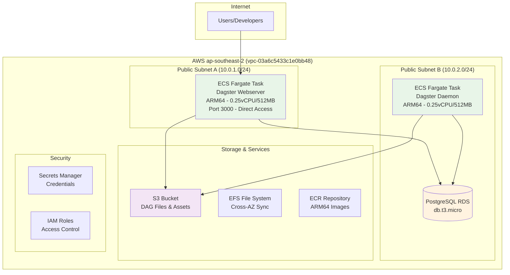
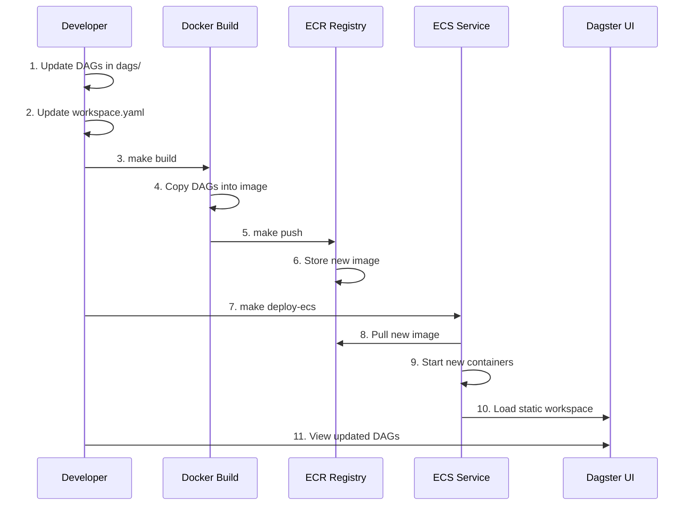
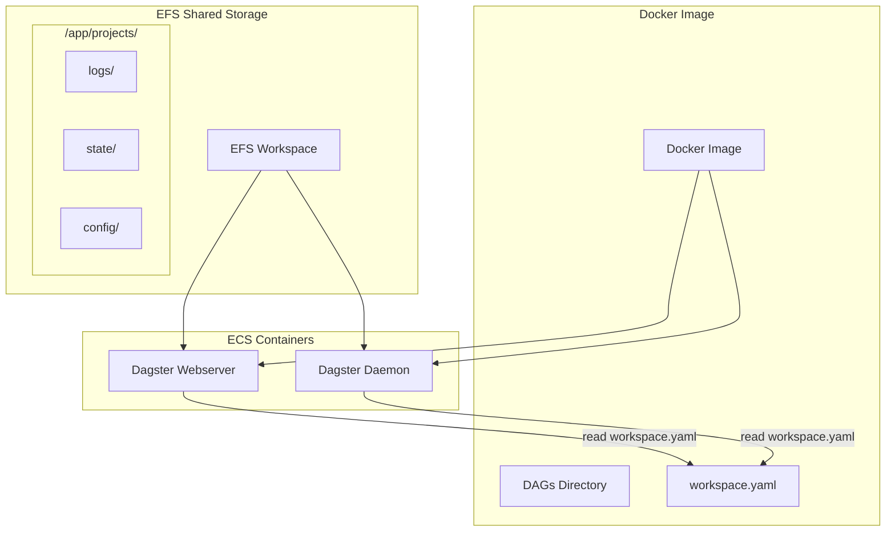
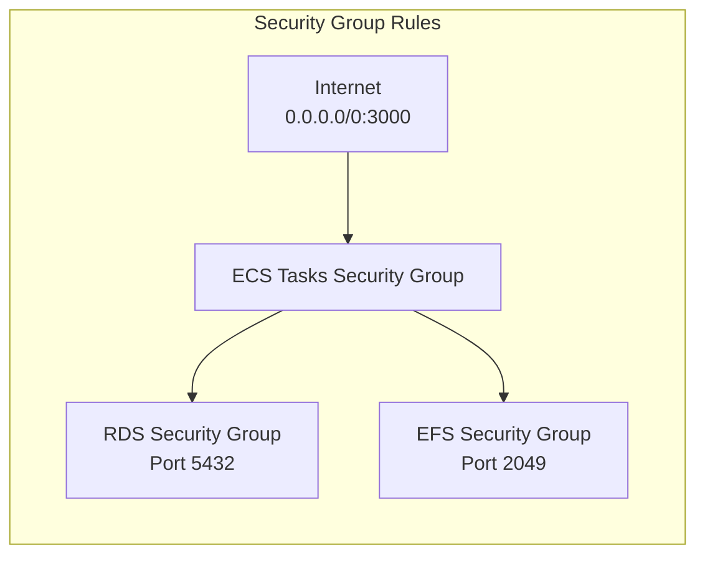
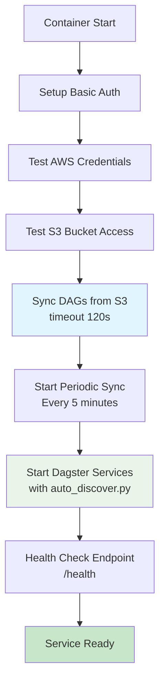

# Dagster ECS Architecture & Infrastructure

## Overview

This document describes the complete architecture of the Dagster ECS Fargate deployment - a cost-optimized, production-ready data orchestration platform running on AWS. The system features **dynamic DAG loading** from S3, eliminating Docker rebuilds for pipeline changes and enabling rapid development cycles.

## Related Documentation

- **[Development Guide](./development.md)**: Local development workflow, testing, and DAG creation
- **[Deployment Guide](./deployment.md)**: Deployment procedures, operations, and troubleshooting

## Table of Contents

- [🏗️ System Architecture](#️-system-architecture)
- [🔄 Dynamic DAG Loading System](#-dynamic-dag-loading-system)
- [🌐 Network Architecture](#-network-architecture)
- [💰 Cost Optimization](#-cost-optimization)
- [🔒 Security Model](#-security-model)
- [📊 Monitoring & Observability](#-monitoring--observability)
- [🛠️ Infrastructure as Code](#️-infrastructure-as-code)
- [🚀 Deployment Architecture](#-deployment-architecture)
- [📁 Project Structure](#-project-structure)

## 🏗️ System Architecture

### High-Level Components



### Infrastructure Specifications

| Component | Configuration | Purpose |
|-----------|---------------|---------|
| **ECS Fargate** | 0.25 vCPU, 512MB RAM (ARM64) | Container runtime |
| **PostgreSQL RDS** | db.t3.micro (Free Tier) | Metadata storage |
| **S3 Bucket** | Standard tier | DAG files & assets |
| **EFS File System** | Burst mode, multi-AZ | Shared storage |
| **ECR Repository** | ARM64 images | Container registry |

## 📦 Static DAG Deployment

### Architecture Benefits

**DAG Deployment Flow:**
```
DAG Change → Docker Build → ECR Push → ECS Deploy → 5-10 minutes
```

### Deployment Process



### Benefits of Static Deployment

1. **Version Control**: DAGs are versioned with the Docker image
2. **Rollback Capability**: Easy rollback to previous versions
3. **Security**: No runtime code injection risks
4. **Performance**: No startup delays for syncing
5. **Reliability**: Predictable deployment behavior

## 🏢 EFS Workspace Management

### Overview

The deployment uses a single EFS filesystem for shared state and workspace management. All DAGs are packaged in the Docker image for reliable deployment.

### Architecture



### Directory Structure

```
/app/                       # Container filesystem
├── dags/                  # DAGs built into image
│   ├── team_analytics/
│   ├── team_ml/
│   └── team_data/
├── workspace.yaml         # Static configuration
└── projects/              # EFS mount point
    ├── logs/              # Shared logs
    ├── state/             # Shared state
    └── config/            # Shared config
```

### Benefits

1. **Simplicity**: No complex sync mechanisms
2. **Reliability**: DAGs always match Docker image version
3. **Performance**: No startup delays
4. **Security**: No external code loading
5. **Shared State**: EFS provides persistent storage for logs and state

## 🌐 Network Architecture

### VPC Configuration
- **CIDR**: 10.0.0.0/16 (65,536 IPs)
- **Subnets**: 2 public subnets across AZs
- **Internet Gateway**: Direct internet access
- **Route Tables**: Default route to internet gateway

### Security Groups



### High Availability Design

- **Multi-AZ Deployment**: Services distributed across availability zones
- **Auto Scaling**: 1-2 instances based on CPU (70%) and memory (80%)
- **Health Checks**: ECS service monitors container health
- **Automatic Recovery**: Failed tasks automatically replaced

## 💰 Cost Optimization

### AWS Free Tier Utilization

| Service | Free Tier Limit | Monthly Cost |
|---------|-----------------|--------------|
| **ECS Fargate** | - | $3-5 (ARM64) |
| **RDS PostgreSQL** | 750 hours | $0 |
| **S3 Storage** | 5GB | $0 |
| **EFS Storage** | 5GB | $0 |

**Total Estimated Cost**: $20-25/month

### Monthly Cost Breakdown

| Service | Free Tier | Post Free Tier |
|---------|-----------|----------------|
| ECS Fargate | $3-5 | $8-12 |
| RDS PostgreSQL | $0 | $12-15 |
| S3 + EFS Storage | $0 | $2-5 |
| **Total** | **$20-25** | **$38-52** |

### Cost Optimization Features

- **ARM64 Architecture**: ~20% cost savings over x86_64
- **Burst Mode EFS**: Cost-effective storage with performance bursting
- **Minimal Resource Allocation**: Optimized for 2-3 concurrent users
- **Auto Scaling**: Resources scale with actual demand
- **Dynamic DAG Loading**: Reduces deployment costs

## 🔒 Security Model

### Principle of Least Privilege

```
ECS Execution Role
├── Read from AWS Secrets Manager ✓
└── Pull container images from ECR ✓

ECS Task Role  
├── Access EFS file system ✓
└── Read from Secrets Manager ✓

IAM User (for S3)
├── s3:GetObject on specific bucket ✓
├── s3:ListBucket on specific bucket ✓
└── s3:GetBucketLocation ✓
```

### Security Features

- **No Hardcoded Credentials**: All secrets stored in AWS Secrets Manager
- **VPC Isolation**: Private networking with security group controls
- **Basic Authentication**: Nginx proxy with configurable credentials
- **Encrypted Storage**: RDS and EFS encryption at rest
- **IAM Roles**: Service-based access control

## 📊 Monitoring & Observability

### CloudWatch Integration

- **Log Groups**: `/ecs/dagster-ecs-fargate`
- **Metrics**: ECS service metrics, auto scaling
- **Health Checks**: Continuous monitoring via load balancer

### Performance Characteristics

- **Direct Access**: No proxy latency
- **ECS → RDS**: < 2ms latency (same VPC)
- **ECS → S3**: 5-20ms latency (regional service)
- **Fargate Network**: Up to 25 Gbps performance

## 🛠️ Infrastructure as Code

### OpenTofu Configuration

The infrastructure is fully defined using OpenTofu (Terraform alternative):

```
infrastructure/
├── main.tf              # Main configuration
├── vpc.tf              # VPC and networking
├── ecs.tf              # ECS cluster and services
├── rds.tf              # PostgreSQL database
├── s3.tf               # S3 storage bucket
├── service_discovery.tf # ECS service discovery
└── outputs.tf          # Infrastructure outputs
```

### Key Outputs

- `dagster_access_note`: Instructions for accessing Dagster
- `s3_bucket_name`: Bucket for DAG storage
- `aws_access_key_id`: S3 access credentials (sensitive)
- `aws_secret_access_key`: S3 secret key (sensitive)

## 🚀 Deployment Architecture

### Container Startup Sequence



### Rolling Deployment Process

1. **Image Build**: New Docker image built and pushed to ECR
2. **ECS Deployment**: Service update triggers rolling deployment
3. **Health Checks**: New tasks must pass health checks
4. **Rolling Update**: ECS gradually replaces tasks
5. **Zero Downtime**: Old tasks terminated only after new ones are healthy

## 📁 Project Structure

```
├── infrastructure/       # OpenTofu configuration files
├── docker/              # Docker configuration & scripts
│   ├── Dockerfile       # Multi-stage build (local + production)
│   ├── multi-repo-entrypoint.sh  # Multi-repo S3 sync script
│   ├── supervisord.conf # Process management
│   └── nginx.conf       # Reverse proxy configuration
├── dagster_config/      # Dagster configuration
│   ├── auto_discover.py # Dynamic DAG discovery (production)
│   ├── auto_discover_local.py # Dynamic DAG discovery (local)
│   ├── workspace-*.yaml # Minimal workspace configs
│   └── dagster-*.yaml   # Dagster instance configs
├── dags/                # Local DAG files (synced to S3)
├── scripts/             # Automation scripts
├── docs/                # Architecture documentation
├── docker-compose.yml   # Local development environment
└── Makefile            # Command abstractions
```

## Next Steps

- For local development setup, see the [Development Guide](./development.md)
- For deployment procedures, see the [Deployment Guide](./deployment.md)

This architecture provides a robust, cost-effective, and scalable foundation for data orchestration workloads with the flexibility to handle both development and production requirements.