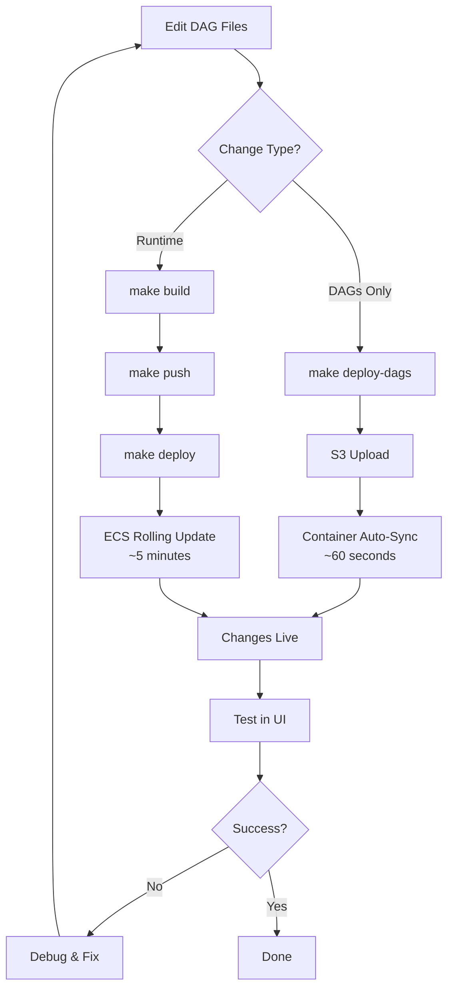

# Deployment Guide & Operations

## Overview

This guide covers deployment processes, operational procedures, and maintenance tasks for the Dagster ECS Fargate deployment. The system supports both rapid DAG deployments (60 seconds) and full infrastructure deployments (5-10 minutes).

## 🚀 Deployment Types

### 1. DAG-Only Deployment (Fast Path)

For pipeline changes without infrastructure modifications:

```bash
# Deploy DAG files to S3 (no Docker rebuild)
make deploy-dags

# Deploy DAGs and restart ECS service
make deploy-all
```

**Timeline**: 60 seconds (S3 upload + container sync)

### 2. Full Infrastructure Deployment

For runtime, infrastructure, or Dockerfile changes:

```bash
# Build and deploy complete system
make build         # Build Docker image
make push          # Push to ECR  
make deploy        # Deploy to ECS
```

**Timeline**: 5-10 minutes (build + deploy)

## 📋 Deployment Workflow

### Initial Setup

1. **Infrastructure Provisioning**
   ```bash
   make infra-init    # Initialize OpenTofu backend
   make infra-plan    # Preview changes
   make infra-apply   # Create AWS resources
   ```

2. **First Deployment**
   ```bash
   make build         # Build Docker image
   make push          # Push to ECR
   make deploy-dags   # Deploy DAGs to S3
   make deploy-ecs    # Deploy containers to ECS
   ```

3. **Verify Deployment**
   ```bash
   make url           # Get Dagster web UI URL
   make ecs-logs      # Monitor container logs
   ```

### Development Workflow



## 🔧 Operations Guide

### Monitoring Commands

```bash
# View application logs
make ecs-logs

# Check service status
aws ecs describe-services --cluster dagster-ecs-fargate-cluster --services dagster-ecs-fargate-service

# Monitor resource utilization
aws cloudwatch get-metric-statistics --namespace AWS/ECS --metric-name CPUUtilization --dimensions Name=ServiceName,Value=dagster-ecs-fargate-service
```

### Scaling Operations

```bash
# Scale up services manually
aws ecs update-service --cluster dagster-ecs-fargate-cluster --service dagster-ecs-fargate-service --desired-count 2

# Scale down (cost saving)
aws ecs update-service --cluster dagster-ecs-fargate-cluster --service dagster-ecs-fargate-service --desired-count 0
```

### Troubleshooting

**Container Won't Start:**
```bash
# Check logs for startup errors
make ecs-logs

# Common issues:
# - Missing DAGSTER_S3_BUCKET environment variable
# - AWS credentials not configured
# - S3 bucket access denied
# - Database connection failed
```

**DAG Sync Issues:**
```bash
# Test S3 access manually
aws s3 ls s3://your-bucket-name/dags/

# Check container sync logs
make ecs-logs | grep "sync"

# Force container restart
make deploy
```

**Health Check Failures:**
```bash
# Check ALB target health
aws elbv2 describe-target-health --target-group-arn $(aws elbv2 describe-target-groups --query 'TargetGroups[0].TargetGroupArn' --output text)

# Test health endpoint
curl http://your-alb-url/health
```

## 🏗️ Local Development

### Development Environment

```bash
# Start local stack
make start         # Docker Compose with PostgreSQL
make logs          # View logs

# Development workflow
make stop          # Stop services
make reset         # Reset database and restart
```

### Local vs Production Parity

The local environment now mirrors production with S3 sync capabilities:

```bash
# Enable S3 sync in local development
export DAGSTER_S3_BUCKET=your-bucket-name
export AWS_ACCESS_KEY_ID=your-key
export AWS_SECRET_ACCESS_KEY=your-secret

# Start with S3 sync enabled
make start
```

**Local Mode (default):**
- `AWS_ACCESS_KEY_ID=local` → Uses local files
- No S3 sync, faster startup

**S3 Mode:**
- Real AWS credentials → Syncs from S3
- Identical to production behavior

## 🗄️ Database Operations

### Database Persistence

**Production (RDS):**
- Instance: `db.t3.micro` (Free Tier)
- Storage: 20GB GP2 with encryption
- Backups: Automated daily backups
- Multi-AZ: Available for high availability

**Local (Docker):**
- Volume mounted for persistence
- Same PostgreSQL version as production

### Database Maintenance

```bash
# Connect to production database
aws rds describe-db-instances --db-instance-identifier dagster-ecs-db

# Database migrations (if needed)
# Dagster handles schema migrations automatically
```

## 📊 Cost Management

### Cost Optimization Strategies

1. **Auto-Shutdown Development Environments**
   ```bash
   # Stop ECS services when not in use
   aws ecs update-service --cluster dagster-ecs-fargate-cluster --service dagster-ecs-fargate-service --desired-count 0
   aws ecs update-service --cluster dagster-ecs-fargate-cluster --service dagster-ecs-daemon-service --desired-count 0
   ```

2. **Monitor Usage**
   ```bash
   # Check AWS costs
   aws ce get-cost-and-usage --time-period Start=2024-01-01,End=2024-01-31 --granularity MONTHLY --metrics BlendedCost
   ```

3. **Free Tier Monitoring**
   - RDS: 750 hours/month (keep under limit)
   - ECS: Minimal ARM64 usage
   - S3: Under 5GB storage
   - EFS: Under 5GB storage

### Monthly Cost Breakdown

| Service | Free Tier | Post Free Tier |
|---------|-----------|----------------|
| ECS Fargate | $3-5 | $8-12 |
| RDS PostgreSQL | $0 | $12-15 |
| Application Load Balancer | $16-20 | $16-20 |
| S3 + EFS Storage | $0 | $2-5 |
| **Total** | **$20-25** | **$38-52** |

## 🔒 Security Operations

### Authentication Management

```bash
# Generate new basic auth credentials
make auth-generate user=admin pass=newpassword

# Deploy new credentials
make auth-deploy user=admin pass=newpassword

# Show current configuration
make auth-show
```

### Credential Rotation

```bash
# Rotate S3 access keys
# 1. Generate new keys in AWS Console
# 2. Update Secrets Manager
aws secretsmanager update-secret --secret-id dagster-ecs-aws-credentials --secret-string '{"AWS_ACCESS_KEY_ID":"new-key","AWS_SECRET_ACCESS_KEY":"new-secret"}'

# 3. Restart ECS services
make deploy
```

### Security Auditing

```bash
# Check IAM permissions
aws iam get-role-policy --role-name dagster-ecs-ecs-task-fargate --policy-name S3Access

# Review security groups
aws ec2 describe-security-groups --group-ids sg-xxxxxxxxx
```

## 🚨 Incident Response

### Common Issues & Solutions

**Service Unavailable:**
1. Check ALB health checks
2. Verify ECS service status
3. Review container logs
4. Check security group rules

**Database Connection Errors:**
1. Verify RDS instance status
2. Check security group connectivity
3. Validate credentials in Secrets Manager
4. Test network connectivity

**S3 Sync Failures:**
1. Verify S3 bucket permissions
2. Check IAM role policies
3. Validate AWS credentials
4. Test bucket access from container

### Emergency Procedures

**Rollback Deployment:**
```bash
# Rollback to previous task definition
aws ecs update-service --cluster dagster-ecs-fargate-cluster --service dagster-ecs-fargate-service --task-definition dagster-ecs-webserver-fargate:previous-revision
```

**Scale Down for Maintenance:**
```bash
# Stop all services
make stop-production  # Custom command to set desired-count to 0
```

**Emergency Access:**
```bash
# Connect to running container (if needed)
aws ecs execute-command --cluster dagster-ecs-fargate-cluster --task task-id --command "/bin/bash" --interactive
```

## 📈 Performance Optimization

### Monitoring Metrics

Key metrics to monitor:
- **ECS CPU Utilization**: Target < 70%
- **ECS Memory Utilization**: Target < 80%
- **ALB Response Time**: Target < 2 seconds
- **Database Connections**: Monitor active connections
- **S3 Sync Duration**: Should complete < 30 seconds

### Performance Tuning

```bash
# Increase container resources (if needed)
# Edit infrastructure/ecs.tf:
# cpu = 512    # 0.5 vCPU
# memory = 1024 # 1GB RAM

# Apply changes
make infra-apply
make deploy
```

## 🔄 Backup & Recovery

### Automated Backups

- **RDS**: 7-day automated backups enabled
- **S3**: Versioning enabled for DAG files
- **Infrastructure**: OpenTofu state stored remotely

### Manual Backup Procedures

```bash
# Backup DAG files
aws s3 sync s3://your-bucket-name/dags/ ./backup/dags/

# Backup database (if needed)
aws rds create-db-snapshot --db-instance-identifier dagster-ecs-db --db-snapshot-identifier manual-backup-$(date +%Y%m%d)
```

### Recovery Procedures

```bash
# Restore DAG files
aws s3 sync ./backup/dags/ s3://your-bucket-name/dags/

# Restore infrastructure from code
make infra-apply
```

This deployment guide provides comprehensive coverage of operational procedures, from routine deployments to emergency response, ensuring reliable and efficient management of your Dagster ECS infrastructure.